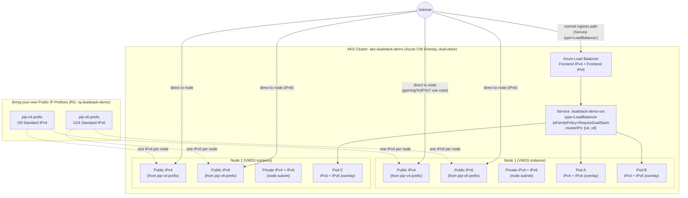

# AKS Dual-Stack + Node Public IP — Architecture Diagrams

## 1. Mermaid diagram (paste into Markdown-capable slide tools, Mermaid Live Editor, or Draw.io's Mermaid import)



**Talking points while showing this slide:**
- Two independent inbound paths exist side by side: the **normal** Service/LoadBalancer path (what almost every cluster uses), and the **direct-to-node** path enabled only because Node Public IP is turned on.
- Every box that says "IPv4 + IPv6" is a live illustration of dual-stack: pods (overlay CIDR), the Service `clusterIPs`, and the node addresses all carry both families simultaneously.
- The dotted lines from the prefixes to each node show the 1:1 allocation — one IPv4 and one IPv6 address per node, drawn from your own reserved prefixes, not ephemeral Azure-assigned addresses.

---

## 2. ASCII fallback (for plain-text decks or terminal walkthroughs)

```
                                   INTERNET
                                       |
         +-----------------------------+-----------------------------+
         |                             |                             |
   (direct-to-node)              (normal ingress)              (direct-to-node)
         |                             |                             |
         v                             v                             v
+-----------------+           +-------------------+          +-----------------+
| Node 1           |          | Azure LoadBalancer |          | Node 2           |
| Pub IPv4 (prefix)|          | FE: IPv4 + IPv6    |          | Pub IPv4 (prefix)|
| Pub IPv6 (prefix)|          +---------+----------+          | Pub IPv6 (prefix)|
| Priv IPv4+IPv6    |                   |                     | Priv IPv4+IPv6    |
|                   |                   v                     |                   |
| Pod A (v4+v6)     |          +-------------------+          | Pod C (v4+v6)     |
| Pod B (v4+v6)     |<-------- | Svc: dualstack-svc |--------->|                   |
+-------------------+          | clusterIPs: v4,v6  |          +-------------------+
                                +-------------------+

Public IP Prefixes (bring-your-own, Standard SKU):
  pip-v4-prefix (/28)  -----> one IPv4 assigned per node
  pip-v6-prefix (/124) -----> one IPv6 assigned per node
```

## 3. One-line summary graphic (good for a title-slide watermark)

```
[ Pod IPv4/IPv6 ]  <-- overlay -->  [ Node IPv4/IPv6 ]  <-- prefix -->  [ Internet ]
        ^                                    ^
        |                                    |
   Service clusterIPs                 az vmss list-instance-public-ips
   (dual-stack proof #1)              (dual-stack proof #2)
```
